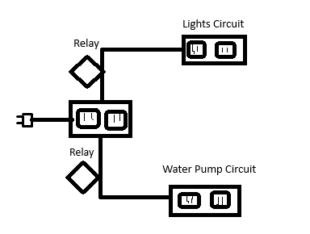

# Relay

The relay is a switch that can be used to control power to a device.
2 relays are used to control the water pump and the lighting.
2 relay board with power strip for the water pump and another power strip for the lighting. Need 2 relays because the timing of the pump and lighting is different.

## Ideas

Main **POWER STRIP** to 2 POWER STRIPS that are controlled by the relays and used to control the pump and lighting.

example: 

